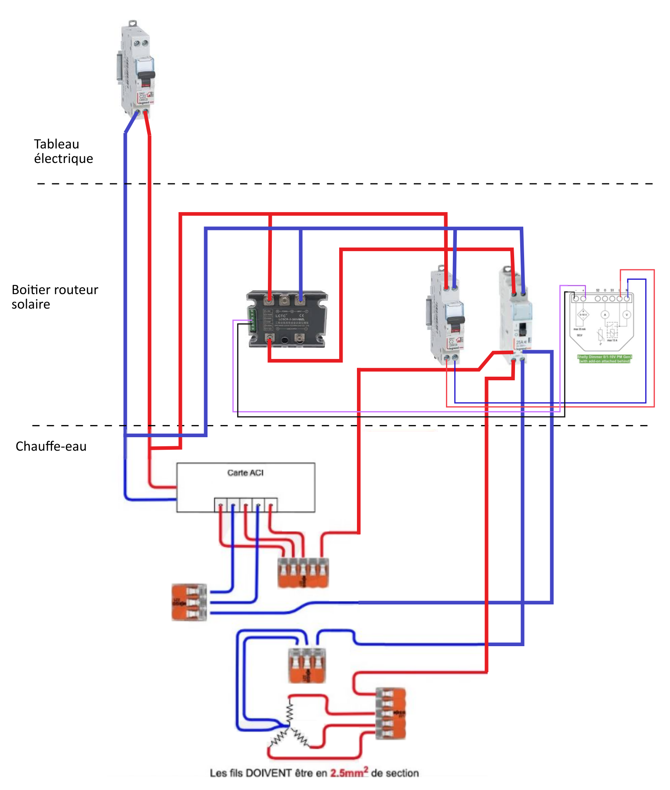
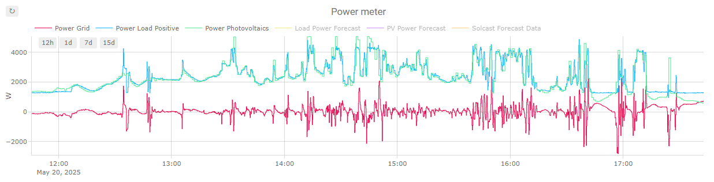

# EMHASS Solar Diverter

A lightweight, purely Python-based Home Assistant script that routes excess solar power (PV) to a variable water heater dimmer (like a Shelly Dimmer). 
It features a built-in PID controller for real-time adjustments and native integration with [**EMHASS** (Energy Management for Home Assistant)](https://github.com/davidusb-geek/emhass).

## Features
* **Real-time PID Control:** Rapidly adjusts the dimmer to keep grid export at exactly 0W.
* **EMHASS "Optim" Mode Integration:** Can follow EMHASS schedules for nighttime heating while still utilizing the PID for daytime solar spikes.
* **Safety First:** Monitors grid voltage to shut down during brownouts.

## ⚠️ Important Warnings & Disclaimer

**DANGER: DEADLY VOLTAGE** This project involves working directly with mains electricity (110V/230V AC). Mains voltage can cause severe injury, fire, or death. 
* **Do not** attempt this build unless you are completely confident in your abilities and understand the risks. 
* Always turn off the main breaker before working on your electrical panel or water heater.
* If you are unsure about any step, consult a licensed, qualified electrician.

**WARRANTY WARNING** Tampering with, modifying, or punching holes in your water heater's casing or insulation will almost certainly **void the manufacturer's warranty**. 

**DISCLAIMER OF LIABILITY** This script, documentation, and hardware schematic are provided "as-is" for educational and informational purposes only. You build and use this setup entirely at your own risk. The author of this repository is not responsible or liable for any property damage, electrical fires, hardware failures, injury, or death that may result from following these instructions or using this code. 

## Hardware Requirements

This solar diverter relies on a specific combination of smart relays and a proportional solid-state voltage regulator. The hardware design is heavily inspired by [this excellent blog post by Yasolr](https://yasolr.carbou.me/blog/2024-07-01_shelly_solar_diverter.html).

To replicate this setup, you will need:

### 1. The Controller: Shelly Dimmer 0/1-10V PM Gen3
This acts as the brain of the hardware, taking the percentage output from the script and converting it into a physical 0-10V signal.
* **Link:** [Shelly Dimmer 0/1-10V PM Gen3](https://www.shelly.com/fr/products/shelly-0-1-10v-dimmer-pm-gen3)
* 🚨 **CRITICAL NOTE:** You must ensure the 0-10V output is **Current Sourcing**, NOT Current Sinking. The LCTC relay requires a sourcing signal to operate correctly. Check the Shelly specifications carefully before purchasing.

### 2. The Main Switching Device: LCTC DTY-220V40P1
This is a Solid State Voltage Regulator (not a standard SSR). It takes the 0-10V control signal from the Shelly Dimmer and proportionally chops the AC sine wave to restrict power to the water heater.
* **Link:** [AliExpress - LCTC DTY Series](https://fr.aliexpress.com/item/1005007756015555.html)
* **Note:** The "40" in the part number means 40 Amps. Please select the amperage rating that safely exceeds your water heater's maximum draw (e.g., a 3000W heater draws ~13A at 230V, so a 25A or 40A SSR is heavily recommended for safety margin and heat dissipation). **You must mount this on a proper aluminum heatsink.**

### 3. Power Monitoring: Shelly Mini Gen4 (PM or EM)
Used to accurately monitor the actual power being consumed by the water heater circuit. This feeds the `WH_POWER_CONSUMPTION_SENSOR` in the script.

### 4. Temperature Monitoring (Optional but highly recommended)
To monitor the system's safety and the water temperature, I use a **Shelly Plus Add-On** equipped with three DS18B20 temperature sensors:
1. **Room Temperature:** Ambient baseline.
2. **Switching Device Temperature:** Attached to the SSR heatsink to ensure it isn't overheating during heavy diversion.
3. **Water Heater Temperature:** I carefully punched a small hole through the thin outer metal sheet and insulation of the water heater tank to insert the probe against the inner tank. (Again, this *will* void your warranty, but it works exceptionally well for accurate readings).

## Software Installation

### Method 1: Using HACS (Recommended)
This script can be easily installed and updated using the [Home Assistant Community Store (HACS)](https://hacs.xyz/).

1. Open HACS in your Home Assistant interface.
2. Click on the 3 dots in the top right corner and select **Custom repositories**.
3. Add the URL of this repository: `https://github.com/davidusb-geek/emhass-solar-diverter`
4. Select **Python script** as the category and click Add.
5. You will now see "EMHASS Solar Diverter" in HACS. Click it and select **Download**.
6. Ensure the `python_script:` integration is enabled in your `configuration.yaml` and restart Home Assistant.

### Method 2: Manual Installation
1. Enable the `python_script` integration in your Home Assistant `configuration.yaml`:
	```yaml
   python_script:
	```
2. Create a folder named `python_scripts` in your Home Assistant config directory.
3. Copy `python_scripts/solar_power_diverter.py` into that folder.
4. Restart Home Assistant.

## Configuration & Helpers
You will need to create the following helpers in Home Assistant:
- `input_select.water_heater_mode` (Options: Solar, Optim, OFF, ON)
- `input_number.pid_integral_term` (Min: -1000, Max: 5000)
- `input_number.pid_previous_error` (Min: -5000, Max: 5000)

Open `solar_power_diverter.py` and ensure the sensor names at the top match your real entities.

## Wiring Diagram
Below is the electrical schematic for connecting the Shelly Dimmer to the water heater.



## Automation
Create an automation to call this script frequently (e.g., every 5 seconds) during the day. 
Note that the script logic only executes if `water_heater_mode` is set to `Solar` or `Optim`.

```yaml
alias: Call PID Solar Power Diverter Script
mode: single
triggers:
  - trigger: time_pattern
    seconds: "/5"
conditions:
  - condition: state
    entity_id: input_select.water_heater_mode
    state: 
      - "Solar"
      - "Optim"
actions:
  - action: python_script.solar_power_diverter
    data: {}
```

## Results
Here is an example result obtained on a cloudy summer day.
The solar diverter effectively regulates the water heater to follow the excess PV power.



## Acknowledgment
This solar diverter hardware was completely inspired on the great `yasolr` project: [https://yasolr.carbou.me](https://yasolr.carbou.me)
